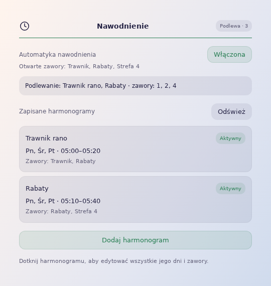

# Irrigation for Home Assistant

Control irrigation valves with weekly schedules and a dashboard card. Everything runs in Home Assistant, even when the dashboard or app is closed. No Node-RED required.

**Version:** 0.2.0 · **Home Assistant:** 2026.10.0 or newer · **Languages:** English, Polish, German

[Polska wersja](docs/README.pl.md)



## Features

- Create, name, edit and delete schedules directly in the card.
- Select weekdays, a time window and valves for each schedule. Editing updates the entire schedule.
- Overlapping schedules can share valves. A valve stays open while any active schedule needs it.
- Support for time windows crossing midnight.
- Automation switch, manual valve controls and live status.
- Interface language follows Home Assistant. Your schedule and valve names stay unchanged.

## Installation

**HACS:** add `https://github.com/MojitoDevelop/irrigation-integration` as a custom repository with category **Integration**, then install **Irrigation**.

**Manual:** copy `custom_components/irrigation_schedule` to `/config/custom_components/irrigation_schedule`.

Restart Home Assistant, then go to **Settings → Devices & services → Add integration → Irrigation**. Select your valve `switch` entities and enter their display names. No valves are selected by default. You can change the valve list later in the integration options.

## Dashboard card

```yaml
type: custom:irrigation-schedule-integration-card
```

The card is registered automatically. Click **Add schedule**, enter a name, select weekdays, times and valves, then save.

Enable **Irrigation automation** to run schedules. Turning it off closes the valves and shows manual controls once closure is confirmed.

You can also supply the valve list in the card YAML. When an administrator loads the card, this list is saved in the integration:

```yaml
type: custom:irrigation-schedule-integration-card
valves:
  - entity: switch.garden_lawn
    name: Lawn
  - entity: switch.garden_beds
    name: Flower beds
```

[Navigation card](examples/navigation-card.yaml) uses `custom:button-card` to show an icon, name and status and open `/irrigation`. It requires button-card to be installed.

## Entities and updates

| Default entity | Purpose |
| --- | --- |
| `switch.irrigation_automation` | Enable or disable automatic irrigation |
| `sensor.irrigation_status` | Current activity and errors |

Schedules use native HA Schedule helpers. Existing entity IDs and schedules are preserved during updates. Replace the integration files, restart HA and refresh the frontend cache. Disable any previous controller using the same valves.

[Installation and troubleshooting](docs/INSTALL.md) · [Changelog](CHANGELOG.md) · [Report an issue](https://github.com/MojitoDevelop/irrigation-integration/issues) · [MIT license](LICENSE)
